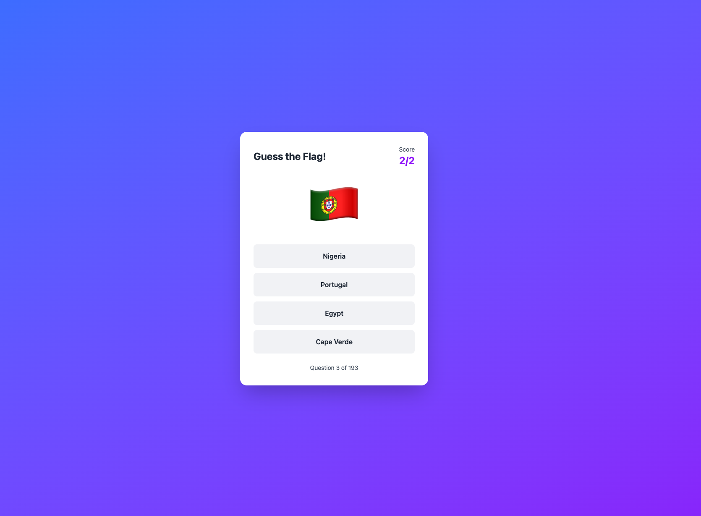

# 🇺🇳 Flag Guesser — A React Flag Guessing Game

This is the react native version of the [Flag Guesser](https://github.com/brunoabpinto/guess-the-flag) game.

A simple and fun React game to **guess the country from its flag**. Players are shown a random flag and must choose the correct country name. Great for learning geography and testing your flag knowledge!

👉 Live site: https://flaguesser.netlify.app/

---

---


# Instalation 👋

This is an [Expo](https://expo.dev) project created with [`create-expo-app`](https://www.npmjs.com/package/create-expo-app).

## Get started

1. Install dependencies

   ```bash
   npm install
   ```

2. Start the app

   ```bash
   npx expo start
   ```

In the output, you'll find options to open the app in a

- [development build](https://docs.expo.dev/develop/development-builds/introduction/)
- [Android emulator](https://docs.expo.dev/workflow/android-studio-emulator/)
- [iOS simulator](https://docs.expo.dev/workflow/ios-simulator/)
- [Expo Go](https://expo.dev/go), a limited sandbox for trying out app development with Expo